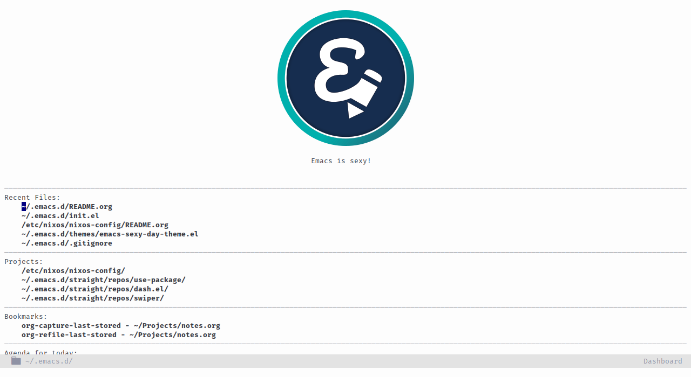

    <h1><i>Literate Emacs</i></h1>
    a literate Emacs configuration using <a href="https://orgmode.org/">org</a>/<a href="https://github.com/OrgTangle/ntangle">ntangle</a>
    

<h3></h3>

This repository contains several important files:
- init.org :: the main configuration file. tangled to init.el via org/ntangle
- snippets.org :: the file where my [yasnippet](https://github.com/joaotavora/yasnippet) snippets are stored. 
- unmanaged :: lisp code or other resources that are not substantial enough to be packaged
  - themes :: my personal emacs theme(s)
  - icons :: png icons taken from [emacs.sexy](http://emacs.sexy)
- straight :: directory where [straight.el](https://github.com/raxod502/straight.el) stores its files.
  - versions/defaut.el :: lockfile for straight.el
- var :: managed by [no-littering.el](https://github.com/emacscollective/no-littering)
- etc :: managed by no-littering.el

In the future this repo will also contain a valid [nix](https://nixos.org/nix/) expression for the ntangle tool, which I use to tangle my org-mode configuration files.

## Current look

